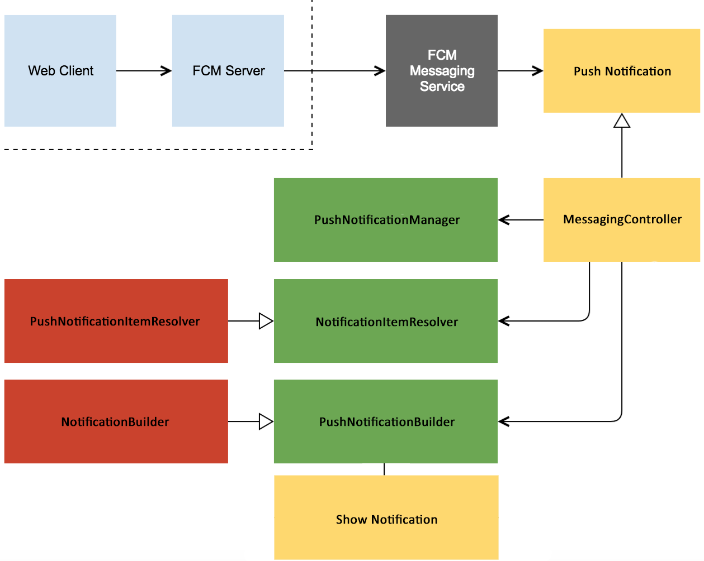

# PushNotificationSkeleton

This repository is as the name says, an application Skeleton totally abstracted to implement easily your own `PushNotification` system using `firebase` or any other *PushNotification* service.

Part of the idea of this skeleton have come from [this Medium Post](https://android.jlelse.eu/android-notifications-an-elegant-way-to-build-and-display-7771d65ba3a2) by [@jovmit](https://medium.com/@jovmit) and .

## How it works

- `MessagingController` is responsible for resolving `PushNotificationItem`. It also decides if the notification should be managed or not. Check the flow:

- `PushNotificationManager` checks the `Type` of our current notification based on a tag in the `Body` of the notitication, after that, it calls the `NotificationItemResolver`
which recieves the notification.

- `NotificationItemResolver` store the current notification ID and the type on a SharedPreferences map which gonna store everything until an activity will be opened from the notification intent. Finally it will go though a swich and decide which kind of `PushNotificationItem` it should return.

- `PushNotificationItem` is a sealed class with the possible `Notitication` types of our application, inside we will decide the text of the notification, the channel and everything.

- Finally the `PushNotificationManager` with the given `PushNotificationItem` will call the `PushNotificationBuilder` which will build the android `Notification` and show it in his respective channel.

And thats all, and easy and well abstracted flow to make our notification work quite easy! Hope that you will enjoy it aswell!
